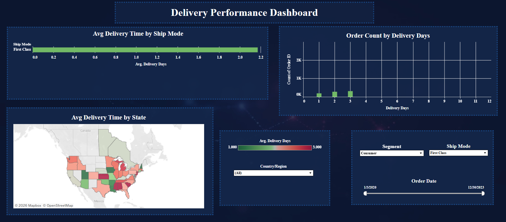

# Superstore Sales & Delivery Performance Dashboard

This project was created as the final project of the Tableau module.  
The main goal of the project was to analyze sales, profit, profitability, and delivery performance using the Sample Superstore dataset.

The project focuses on creating interactive Tableau visualizations and dashboards that help users understand business performance across time, product categories, shipping methods, customer segments, shipping methods, and U.S. states.

## Tableau Public Dashboard

You can view the interactive Tableau project here:

[View the Tableau Public Dashboard](https://public.tableau.com/app/profile/g.n.aydo.an/viz/SuperstoreSalesProfitabilityDeliveryAnalysis/DeliveryPerformanceDashboard)

## Repository Name

```text
Superstore-Sales-Delivery-Tableau-Dashboard
```

## Project Objective

The objective of this project was to build a complete Tableau dashboard project using the Sample Superstore dataset.

The analysis was designed to answer three main business questions:

1. How did sales and profit change over time between 2020 and 2023?
2. Which product categories, sub-categories, and shipping methods are more or less profitable?
3. How does delivery performance vary by shipping method, delivery duration, and U.S. state?

The project combines time series analysis, profitability analysis, delivery performance analysis, calculated fields, filters, dual-axis charts, and geographic visualization.

## Dataset

The project uses the **Sample Superstore** dataset.

Dataset file included in this repository:

```text
Sample_Superstore.xls
```

Main fields used in the analysis:

- Order ID
- Order Date
- Ship Date
- Ship Mode
- Segment
- Country / Region
- State
- Category
- Sub-Category
- Sales
- Profit

## Dashboard 1: Sales and Profit Time Series

The first part of the project analyzes monthly sales and profit trends between 2020 and 2023.

A time series visualization was created using **Order Date** at the monthly level.  
Total sales and total profit were displayed in the same visualization using a **dual-axis chart**.

### Main Steps

- Used Order Date as the time dimension.
- Aggregated the data by month.
- Added Sales and Profit to the same chart.
- Created a dual-axis visualization.
- Synchronized the axis to keep both measures on the same scale.
- Formatted the y-axis values as currency.
- Added interactive filters for Ship Mode and Segment.
- Configured the filters with an Apply button.

### Filters Used

- Ship Mode
- Segment

Both filters were configured with an **Apply button**, allowing users to change filter selections first and apply them only when ready.

### Purpose

This visualization helps users monitor how sales and profit changed over time and compare whether profit followed the same trend as sales.

It provides a high-level view of business performance across months and years.

## Dashboard 2: Profitability Analysis by Category and Shipping Method

The second part of the project analyzes profitability across product categories, sub-categories, and shipping methods.

The goal was to understand which product groups and shipping methods generated stronger or weaker profit performance.

### Main Dimensions Used

- Category
- Sub-Category
- Ship Mode

Category and Sub-Category were placed in a hierarchical structure so that profitability could be analyzed from a broader category level down to a more detailed sub-category level.

### Calculated Field

A calculated field was created to measure relative profit percentage.

```text
Profit Ratio = SUM(Profit) / SUM(Sales)
```

This metric shows how much profit was generated compared to sales.

### Main Steps

- Added Category and Sub-Category as columns.
- Added Ship Mode as rows.
- Created the Profit Ratio calculated field.
- Displayed Profit Ratio as a percentage.
- Applied a diverging color scale.
- Set zero as the center of the color scale.
- Added row and column subtotals.

### Purpose

This visualization helps identify profitable and unprofitable combinations of product categories, sub-categories, and shipping methods.

A diverging color scale was used so that negative and positive profitability could be visually separated.  
The zero point was placed at the center of the color scale to make neutral profitability easier to interpret.

This makes it easier to detect which business areas may require further investigation or optimization.

## Dashboard 3: Delivery Performance Dashboard

The third part of the project focuses on delivery performance.

The dashboard analyzes the time difference between order date and ship date, showing how delivery performance varies by shipping method, delivery duration, and U.S. state.

### Calculated Field

A calculated field was created to calculate delivery duration for each order.

```text
Delivery Days = DATEDIFF('day', [Order Date], [Ship Date])
```

This field calculates the number of days between the order date and ship date.

## Delivery Performance Visualizations

The delivery dashboard includes three main visualizations.

### 1. Average Delivery Time by Ship Mode

This chart shows the average delivery duration for each shipping method.

It helps compare how different shipping modes perform in terms of speed.

Shipping methods analyzed include:

- First Class
- Same Day
- Second Class
- Standard Class

### 2. Order Count by Delivery Days

This chart shows how many orders were shipped within each delivery duration.

For example, it shows how many orders took 0 days, 1 day, 2 days, and so on.

This helps identify the most common delivery durations in the dataset.

### 3. Average Delivery Time by State

A U.S. map was created to show the average delivery time by state.

Each state is colored using a gradient based on average delivery duration.

This makes it easier to identify geographic differences in delivery performance and compare delivery efficiency across states.

## Dashboard Filters

The Delivery Performance Dashboard includes interactive filters for:

- Order Date
- Segment
- Ship Mode

These filters were applied to the dashboard visualizations so users can analyze delivery performance by time period, customer segment, and shipping method.

## Dashboard Preview

The screenshot below shows the Delivery Performance Dashboard created in Tableau.

Screenshot file included in this repository:

```text
Superstore_Sales_Delivery_Performance_Dashboard.png
```



> Note: The image file is stored inside the `images` folder.  
> Because the filename contains spaces, the spaces are written as `%20` in the Markdown image path.

## Repository Structure

```text
Superstore-Sales-Delivery-Tableau-Dashboard/
│
├── README.md
├── Sample_Superstore.xls
└── images/
    └── Screenshot 2026-05-28 124053.png
```

## Tools Used

- Tableau Public
- Microsoft Excel
- Data Visualization
- Business Intelligence
- Dashboard Design
- Calculated Fields
- Dual-Axis Charts
- Interactive Filters
- Geographic Visualization
- Time Series Analysis

## Tableau Features Used

- Dual-axis chart
- Synchronized axis
- Calculated fields
- Date aggregation
- Interactive filters
- Apply button filters
- Color gradients
- Diverging color scale
- Geographic map visualization
- Dashboard layout design
- Row and column subtotals

## Key Insights

- Sales and profit can be analyzed together over time to understand overall business performance.
- Monthly time series analysis helps identify changes in sales and profit between 2020 and 2023.
- Profitability differs across product categories, sub-categories, and shipping methods.
- Some category and shipping method combinations perform better than others in terms of profit ratio.
- Delivery performance varies depending on the selected shipping method.
- Order count by delivery days helps identify the most common delivery durations.
- State-level delivery analysis shows geographic variation in average delivery time.
- Interactive filters allow users to explore the data by order date, customer segment, and ship mode.

## Project Outcome

This project demonstrates the ability to build a complete Tableau dashboard project from raw business data.

The final Tableau project includes sales trend analysis, profitability analysis, and delivery performance analysis in an interactive format.

Through this project, I practiced:

- Building Tableau worksheets and dashboards
- Creating calculated fields
- Using business metrics such as sales, profit, profit ratio, and delivery days
- Designing interactive dashboards
- Applying filters across multiple visualizations
- Using maps for geographic analysis
- Creating dual-axis time series visualizations
- Formatting business metrics clearly
- Presenting business insights through visual storytelling

The final dashboard provides a structured view of sales, profit, profitability, and delivery performance, helping users explore operational and financial patterns in the Sample Superstore dataset.

## Author

Created by **Fatma Günışığı Aydoğan** as part of a Tableau data analytics module final project.
